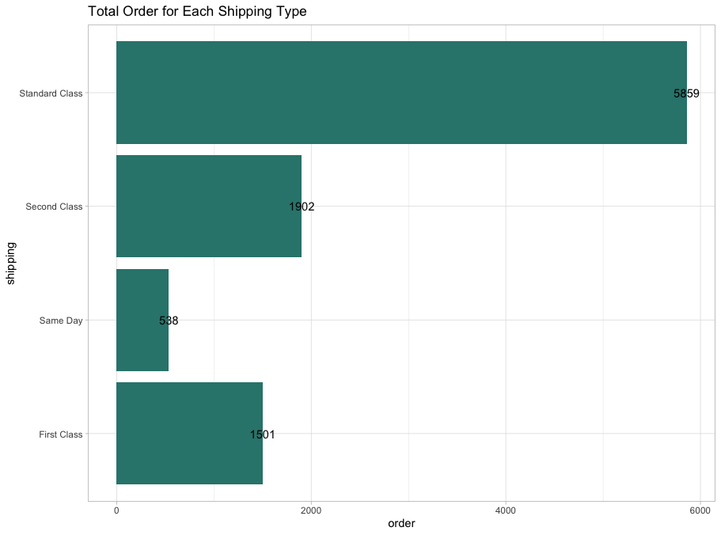
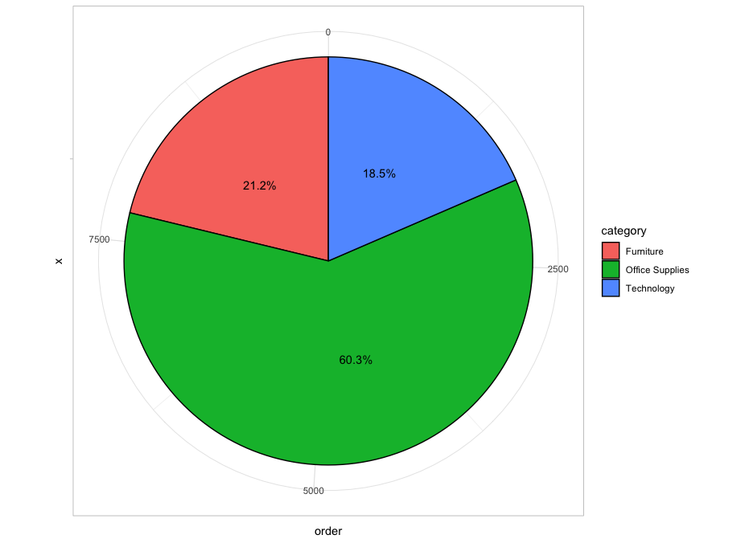

# R-Assignment 4

**Created by Phumin Chumphu (ID: 63130500094)**

Dataset : [Superstore Sales Dataset](../SuperstoreDataset.csv)


### Outlines
1. Explore the dataset
2. Learning function from Tidyverse
3. Transform data with dplyr and finding insight the data
4. Visualization with GGplot2

## Part 1: Explore the dataset
Retail dataset of a global superstore for 4 years 
Perform EDA and Predict the sales of the next 7 days from the last date of the Training dataset!
```R
# Library
library(readr)
library(dplyr)
library(DescTools)
library(forcats)
library(stringr)
library(ggplot2)
library(scales)

# Import Dataset
superstore <- read.csv('https://raw.githubusercontent.com/safesit23/INT214-Statistics/main/datasets/superstore_sales.csv')

# Explore Dataset
View(superstore)
glimpse(superstore)
```

In this dataset have 9,800 Rows and 18 Columns
```
Rows: 9,800
Columns: 18
$ Row.ID        <int> 1, 2, 3, 4, 5, 6, 7, 8, 9, 10, 11, 12, 13, 14, 15, 16, 17, 18, 19, 20,…
$ Order.ID      <chr> "CA-2017-152156", "CA-2017-152156", "CA-2017-138688", "US-2016-108966"…
$ Order.Date    <chr> "08/11/2017", "08/11/2017", "12/06/2017", "11/10/2016", "11/10/2016", …
$ Ship.Date     <chr> "11/11/2017", "11/11/2017", "16/06/2017", "18/10/2016", "18/10/2016", …
$ Ship.Mode     <chr> "Second Class", "Second Class", "Second Class", "Standard Class", "Sta…
$ Customer.ID   <chr> "CG-12520", "CG-12520", "DV-13045", "SO-20335", "SO-20335", "BH-11710"…
$ Customer.Name <chr> "Claire Gute", "Claire Gute", "Darrin Van Huff", "Sean O'Donnell", "Se…
$ Segment       <chr> "Consumer", "Consumer", "Corporate", "Consumer", "Consumer", "Consumer…
$ Country       <chr> "United States", "United States", "United States", "United States", "U…
$ City          <chr> "Henderson", "Henderson", "Los Angeles", "Fort Lauderdale", "Fort Laud…
$ State         <chr> "Kentucky", "Kentucky", "California", "Florida", "Florida", "Californi…
$ Postal.Code   <int> 42420, 42420, 90036, 33311, 33311, 90032, 90032, 90032, 90032, 90032, …
$ Region        <chr> "South", "South", "West", "South", "South", "West", "West", "West", "W…
$ Product.ID    <chr> "FUR-BO-10001798", "FUR-CH-10000454", "OFF-LA-10000240", "FUR-TA-10000…
$ Category      <chr> "Furniture", "Furniture", "Office Supplies", "Furniture", "Office Supp…
$ Sub.Category  <chr> "Bookcases", "Chairs", "Labels", "Tables", "Storage", "Furnishings", "…
$ Product.Name  <chr> "Bush Somerset Collection Bookcase", "Hon Deluxe Fabric Upholstered St…
$ Sales         <dbl> 261.9600, 731.9400, 14.6200, 957.5775, 22.3680, 48.8600, 7.2800, 907.1…
```


## Part 2: Learning function from Tidyverse

- Function `select()` from package [dplyr](https://dplyr.tidyverse.org/articles/dplyr.html#select-columns-with-select)). It using for select columns

```R
starwars %>% select(name,height)
```
** You can sepearate this part or combine in part of `Transform data with dplyr and finding insight the data`

## Part 3: Transform data with dplyr and finding insight the data
1. City ไหนมียอดรวมสั่งซื้อมากที่สุด
```R
superstore %>% group_by(City) %>% select(City, Sales) %>% summarise(all_sales = sum(Sales)) %>% arrange(desc(all_sales)) %>% head(1)
```

Result:
```R
# A tibble: 1 × 2
  City          all_sales
  <chr>             <dbl>
1 New York City   252463.
```
Explain:
New York City มียอดรวมสั่งซื้อมากที่สุด คือ 252,463 $

-----

2. นับจำนวน Order ทั้งหมดที่มีการจัดส่งในแต่ละรูปแบบการจัดส่ง
```R
shipping_type <- table(superstore$Ship.Mode)
shipping_type
```

Result:
```R
   First Class       Same Day   Second Class Standard Class 
          1501            538           1902           5859 
```
Explain:
- มีการเลือกใช้การจัดส่งแบบ First Class ทั้งหมด 1501 order
- มีการเลือกใช้การจัดส่งแบบ Same Day ทั้งหมด 538 order
- มีการเลือกใช้การจัดส่งแบบ Second Class ทั้งหมด 1902 order
- มีการเลือกใช้การจัดส่งแบบ Standard Class ทั้งหมด 5859 order

-----

3. Region ไหนมีการเลือกจะส่งแบบ Same Day มากที่สุด
```R
shipping_region <- superstore %>% filter(Ship.Mode == "Same Day") %>% group_by(Region)
shipping_region %>% tally(sort = TRUE) %>% head(1) 
```

Result:
```R
# A tibble: 1 × 2
  Region     n
  <chr>  <int>
1 West     183
```
Explain:
West มีการจัดส่งแบบ Same Day มากที่สุด โดยมีการเลือกการจัดส่งรูปแบบนี้ 183 order

-----

4. New York City มียอดการสั่งซื้อในแต่ละ Category เท่าไหร่
```R
superstore %>% filter(City == 'New York City') %>% group_by(Category) %>% tally(sort = TRUE)
```

Result:
```R
  Category            n
  <chr>           <int>
1 Office Supplies   535
2 Furniture         187
3 Technology        169
```
Explain:
- Office Supplies มีทั้งหมด 535 order
- Furniture มีทั้งหมด 187 order
- Technology มีทั้งหมด 169 order

-----

5. จัดอันดับ Customer 3 อันดับที่มีการสั่งซื้อสินค้าประเภท Furniture มากที่สุด
```R
customer_order <- superstore %>% filter(Category == 'Furniture') %>% group_by(Customer.Name)
customer_order %>% tally(sort = TRUE) %>% head(n=3)
```

Result:
```R
# A tibble: 3 × 2
  Customer.Name       n
  <chr>           <int>
1 Seth Vernon        15
2 Caroline Jumper     9
3 Joel Eaton          9
```
Explain:
- Seth Vernon มีทั้งหมด 15 order
- Caroline Jumper มีทั้งหมด 9 order
- Joel Eaton มีทั้งหมด 9 order

-----

6. หาค่าเฉลี่ยของยอดคำสั่งซื้อทั้งหมด
```R
superstore %>% summarise(mean(superstore$Sales)) %>% rename("Average Sales" = `mean(superstore$Sales)`)
```

Result:
```R
  Average Sales
1      230.7691
```
Explain:
ยอดคำสั่งซื้อทั้งหมดใน Superstore มีค่าเฉลี่ยอยู่ที่ 230.7691 $

-----

## Part 4: Visualization with GGplot2
### 1.) Graph Show Total Order For Each Shipping Type
```R
shipping_order <- data.frame(table(superstore$Ship.Mode))
shipping_order <- shipping_order %>% rename("shipping"=Var1, "order"=Freq)
shipping_order %>% 
  ggplot(aes(x=shipping, y=order)) + 
  geom_bar(fill="#2F847C", stat="identity") +
  geom_text(aes(label = order), position = position_identity()) +
  coord_flip() +
  theme_light() +
  ggtitle("Total Order for Each Shipping Type")
```
Result:



-----
### 2.) Graph Show Total Order For Each Category
```R
category_order <- data.frame(table(superstore$Category))
category_order <- category_order %>% rename("category"=Var1, "order"=Freq)
category_order %>% 
  ggplot(aes(x="", y=order, fill=category)) + 
  geom_bar(stat="identity", width=1, color="black") +
  coord_polar("y", start=0) +
  theme_light() +
  geom_text(aes(label = percent(order/sum(order))), position = position_stack(vjust=0.45))
```
Result:



