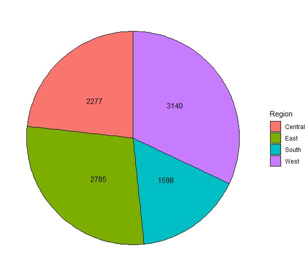
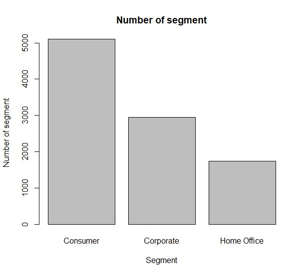

# R-Assignment 4

**Created by Siripong Phiwkhaw (ID: 63130500109)**

 Dataset: Superstore Sales Dataset (Data from Rohit Sahoo,[Kaggle](https://www.kaggle.com/rohitsahoo/sales-forecasting)) >> [Using CSV](https://raw.githubusercontent.com/safesit23/INT214-Statistics/main/datasets/superstore_sales.csv)

Part B : [MyPowerBi](https://app.powerbi.com/view?r=eyJrIjoiMzU3ZjQyNGMtMTZlMC00ZTNmLWJlM2ItMGEzZjY4ZTQ0ZTgwIiwidCI6IjZmNDQzMmRjLTIwZDItNDQxZC1iMWRiLWFjMzM4MGJhNjMzZCIsImMiOjEwfQ%3D%3D)

### Outlines
1. Explore the dataset
2. Learning function from Tidyverse
3. Transform data with dplyr and finding insight the data
4. Visualization with GGplot2

## Part 1: Explore the dataset

```
#import packages
library(readr)      
library(dplyr)      
library(DescTools)     
library(ggplot2)    


#import dataset
superstore <- read_csv("https://raw.githubusercontent.com/safesit23/INT214-Statistics/main/datasets/superstore_sales.csv")

#expore dataset
View(superstore)
glimpse(superstore)
```

In this dataset has 
```
Rows: 9,800
Columns: 18
$ `Row ID`        <dbl> 1, 2, 3, 4, 5, 6, 7, 8, 9, 10, 11, 12, 13, 14, 15, 16, 17, 18, 19, 20, 21, 22, 23, 24, 25, 2~
$ `Order ID`      <chr> "CA-2017-152156", "CA-2017-152156", "CA-2017-138688", "US-2016-108966", "US-2016-108966", "C~
$ `Order Date`    <chr> "08/11/2017", "08/11/2017", "12/06/2017", "11/10/2016", "11/10/2016", "09/06/2015", "09/06/2~
$ `Ship Date`     <chr> "11/11/2017", "11/11/2017", "16/06/2017", "18/10/2016", "18/10/2016", "14/06/2015", "14/06/2~
$ `Ship Mode`     <chr> "Second Class", "Second Class", "Second Class", "Standard Class", "Standard Class", "Standar~
$ `Customer ID`   <chr> "CG-12520", "CG-12520", "DV-13045", "SO-20335", "SO-20335", "BH-11710", "BH-11710", "BH-1171~
$ `Customer Name` <chr> "Claire Gute", "Claire Gute", "Darrin Van Huff", "Sean O'Donnell", "Sean O'Donnell", "Brosin~
$ Segment         <chr> "Consumer", "Consumer", "Corporate", "Consumer", "Consumer", "Consumer", "Consumer", "Consum~
$ Country         <chr> "United States", "United States", "United States", "United States", "United States", "United~
$ City            <chr> "Henderson", "Henderson", "Los Angeles", "Fort Lauderdale", "Fort Lauderdale", "Los Angeles"~
$ State           <chr> "Kentucky", "Kentucky", "California", "Florida", "Florida", "California", "California", "Cal~
$ `Postal Code`   <dbl> 42420, 42420, 90036, 33311, 33311, 90032, 90032, 90032, 90032, 90032, 90032, 90032, 28027, 9~
$ Region          <chr> "South", "South", "West", "South", "South", "West", "West", "West", "West", "West", "West", ~
$ `Product ID`    <chr> "FUR-BO-10001798", "FUR-CH-10000454", "OFF-LA-10000240", "FUR-TA-10000577", "OFF-ST-10000760~
$ Category        <chr> "Furniture", "Furniture", "Office Supplies", "Furniture", "Office Supplies", "Furniture", "O~
$ `Sub-Category`  <chr> "Bookcases", "Chairs", "Labels", "Tables", "Storage", "Furnishings", "Art", "Phones", "Binde~
$ `Product Name`  <chr> "Bush Somerset Collection Bookcase", "Hon Deluxe Fabric Upholstered Stacking Chairs, Rounded~
$ Sales           <dbl> 261.9600, 731.9400, 14.6200, 957.5775, 22.3680, 48.8600, 7.2800, 907.1520, 18.5040, 114.9000~
```
|Number|Column name|Data type|Details|
|----|------|----|-------|
|1|Row ID|double|ID ของ โรล|
|2|Order ID|character|ID ของเเต่ละออเดอร์|
|3|Order Date|character|วันที่ที่เกิดออเดอร์|
|4|Ship Date|character|วันที่สิ่งของถูกจัดส่ง|
|5|Ship mode|character|ประเภทของการขนส่ง|
|6|Customer ID|character|ID ของลูกค้าเเต่ละคน|
|7|Customer Name|character|ชื่อของลูกค้า|
|8|Segment|character|ประเภทของลูกค้า|
|9|Country|character|ประเทศของล|
|10|City|character|ประเทศของลูกค้า|
|11|State|character|รัฐของลูกค้า|
|12|Postal Code|double|รหัสไปรษณีย์ของลูกค้า|
|13|Region|character|ภูมิภาคของลูกค้า|
|14|Product ID|character|IDของสิ่งของ|
|15|Category|character|ประเภทของสิ่งของ|
|16|Sub-Category|character|ประเภทย่อยของสิ่งของ|
|17|Product Name|character|ชื่อสิ่งของ|
|18|Sales|double|ราคาของเเต่ละออเดอร์|

## Part 2: Learning function from Tidyverse

Package dplyr
- Function `select()`  เลือกชื่อคอลัมน์ที่จะให้เเสดงผล
- Function `group_by()` จัดกลุ่มข้อมูล
```
x <- superstore %>% select(`Ship Mode`)
```
```
superstore %>% group_by(Category)
```
Package ggplot2
- Function `theme_void()` ลบพื้นหลังของกราฟ
- Function `geom_text()`  เพิ่มtextลงบนกราฟ

```
Region <- data.frame(table(superstore$Region))
View(Region)
Region <- Region %>% rename("Region"=Var1,"count"=Freq)
Region %>% 
  ggplot(aes(x="",y=count,fill=Region)) + 
  geom_bar(stat="identity", width=2, color="black") +
  coord_polar("y", start=0)+theme_void()+
  geom_text(aes(label = count), position = position_stack(vjust = 0.45))
```


## Part 3: Transform data with dplyr and finding insight the data

1.หาว่า segment ไหนมีจำนวนออเดอร์มากที่สุด

```
superstore %>%count(Segment,sort = TRUE)%>% head(n=1)
```

Result:

```
# A tibble: 1 x 2
  Segment      n
  <chr>    <int>
1 Consumer  5101
```
Explain -> Segment consumer มีจำนวนออเดอร์มากที่สุด คือ 5101 ออเดอร์

2.หาว่า Ship Mode Standard Class มีจำนวนออเดอร์ทั้งหมดกี่ออเดอร์
```
 v <- superstore %>% select(`Ship Mode`)%>% filter(`Ship Mode`=="Standard Class")
 v %>% count(`Ship Mode`)
```

Result:

```
# A tibble: 1 x 2
  `Ship Mode`        n
  <chr>          <int>
1 Standard Class  5859
```
Explain->  Standard Class มีออเดอร์ทั้งหมด  5859 ออเดอร์

3.หาว่าเเต่ละ Categorมีจำนวนออเดอร์เท่าไร
```
superstore %>% group_by(Category) %>% count()%>% arrange(desc(n))
```

Result:

```
# A tibble: 3 x 2
# Groups:   Category [3]
  Category            n
  <chr>           <int>
1 Office Supplies  5909
2 Furniture        2078
3 Technology       1813
```
Explain-> เเต่ละ category มีจำนวนออเดอร์ดังนี้ Office Supplies = 5909,Furniture=2078,Technology=1813

4.หาราคาที่สูงที่สุดของเเต่ละ region
```
superstore %>% group_by(Region) %>% summarise(max(Sales))
```

Result:

```
# A tibble: 4 x 2
  Region  `max(Sales)`
  <chr>          <dbl>
1 Central       17500.
2 East          11200.
3 South         22638.
4 West          14000.
```
Explain-> ราคาที่สูงที่สุดของเเต่ละregion มีดังนี้ Central=17500,East=11200,South=22638,West=14000.

5.หาราคาเฉลี่ยของ superstore
```
superstore %>% summarise(Mean(Sales)) %>% rename("average" = `Mean(Sales)`)
```

Result:

```
# A tibble: 1 x 1
  average
    <dbl>
1    231.
```
Explain-> ราคาเฉลี่ยของsuperstore คือ 231

6.หา3อันดับ PostalCodeเเละจำนวนออเดอร์ ที่มีจำนวนออเดอร์มากที่สุด
```
superstore %>% group_by(`Postal Code`) %>% count(`Postal Code`,sort = TRUE) %>% arrange(desc(n)) %>% head(n=3)
```

Result:

```
# A tibble: 3 x 2
# Groups:   Postal Code [3]
  `Postal Code`     n
          <dbl> <int>
1         10035   253
2         10024   225
3         10009   220
```
Explain-> 3อันดับ PostaCode ที่มีออเดอร์มากที่สุด3อันดับคือ 10035,10024,10009 เเละจำนวนออเดอร์ดังนี้ 253,225,220

## Part 4: Visualization with GGplot2
### 1.) จำนวนออเดอร์จากเเต่ละภูมิภาค
```
Region <- data.frame(table(superstore$Region))
View(Region)
Region <- Region %>% rename("Region"=Var1,"count"=Freq)
Region %>% 
  ggplot(aes(x="",y=count,fill=Region)) + 
  geom_bar(stat="identity", width=2, color="black") +
  coord_polar("y", start=0)+theme_void()+
  geom_text(aes(label = count), position = position_stack(vjust = 0.45))
```
Result:



### 2.) จำนวนsegmentของเเต่ละorder
```
numb_segment <-  table(superstore$`Segment`)
barplot(numb_segment)
barplot(numb_segment,main = "Number of segment",xlab = "Segment",ylab = "Number of segment")
```
Result:



