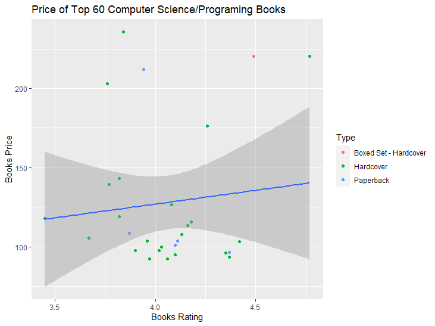

# R-Assignment 4

**Created by Anuwat Pattanajan (ID: 63130500129)**

Choosen Dataset:
1. Top 270 Computer Science / Programing Books (Data from Thomas Konstantin, [Kaggle](https://www.kaggle.com/thomaskonstantin/top-270-rated-computer-science-programing-books)) >> [Using CSV](https://raw.githubusercontent.com/safesit23/INT214-Statistics/main/datasets/prog_book.csv)

### Outlines
1. Explore the dataset
2. Learning function from packages
3. Transform data with dplyr and finding insight the data
4. Visualization with GGplot2

## Part 1: Explore the dataset

```
# Library Used
library(dplyr)
library(readr)
library(stringr)
library(ggplot2)

# Dataset
book_prog <- read_csv("https://raw.githubusercontent.com/safesit23/INT214-Statistics/main/datasets/prog_book.csv")
```
### View Dataset
```
View(book_prog)
glimpse(book_prog)
```

In this dataset has 271 rows and 7 columns
```
Rows: 271
Columns: 7
$ Rating          <dbl> 4.17, 4.01, 3.33, 3.97, 4.06, 3.84, 4.09, 4.15, 3.87, 4.62, 4.03, 3.78, 3.73, 3.87, 3.87, 3.95, 3.~
$ Reviews         <chr> "3,829", "1,406", "0", "1,658", "1,325", "117", "5,938", "1,817", "2,093", "0", "160", "481", "33"~
$ Book_title      <chr> "The Elements of Style", "The Information: A History, a Theory, a Flood", "Responsive Web Design O~
$ Description     <chr> "This style manual offers practical advice on improving writing skills. Throughout, the emphasis i~
$ Number_Of_Pages <int> 105, 527, 50, 393, 305, 288, 256, 368, 259, 128, 352, 352, 200, 328, 240, 288, 392, 304, 336, 542,~
$ Type            <chr> "Hardcover", "Hardcover", "Kindle Edition", "Hardcover", "Kindle Edition", "Paperback", "Hardcover~
$ Price           <dbl> 9.323529, 11.000000, 11.267647, 12.873529, 13.164706, 14.188235, 14.232353, 14.364706, 14.502941, ~
```

- `Rating`          : The user rating for the book. the rating score ranges between 0 and 5
- `Reviews`         : The number of reviews found on this book.
- `Book_title`      : The name of the book.
- `Description`     : a short description of the book .
- `Number_Of_Pages` : Number of pages in the book
- `Type`            : The type of the book meaning is it a hardcover book or an ebook or a kindle book etc.
- `Price`           : The average price of the book in USD where the average is calculated according the 5 web sources.


## Part 2: Learning function from packages

### Package [dplyr](https://dplyr.tidyverse.org/articles/dplyr.html#select-columns-with-select)
- `select()`  : changes whether or not a column is included.
```r
select(book_prog,Book_title) 
```
- `arrange()` : changes the order of the rows.
```r
book_prog %>% arrange(desc(Price)) %>% select(Price,Rating,Book_title) %>% head(n=3)
```
- `rename()`  : changes the name of columns.
```r
book_prog %>% rename(Book_Name = Book_title)
```
- `filter()`  : chooses rows based on column values.
```r
book_prog %>% filter(Price < 20 )
```

## Part 3: Transform data with dplyr and finding insight the data

### 1. หนังสือเกี่ยวกับวิทยาการคอมพิวเตอร์และโปรแกรมมิ่งที่ได้รับเรตติ้งดีที่สุดเป็น 5 อันดับแรก

```
book_prog %>% arrange(desc(Rating)) %>% select(Rating,Price,Book_title) %>% head(n=5)
```
#### Result:
```
  Rating     Price                                                                                               Book_title
1   5.00  25.85588                                                                                  Your First App: Node.js
2   4.77 220.38529                                                  The Art of Computer Programming, Volumes 1-4a Boxed Set
3   4.72  45.56176 Designing Data-Intensive Applications: The Big Ideas Behind Reliable, Scalable, and Maintainable Systems
4   4.67  42.27647              Build Web Applications with Java: Learn every aspect to build web applications from scratch
5   4.67  64.09118                                                 Fluent Python: Clear, Concise, and Effective Programming
```
ใช้คำสั่ง `arrange(desc(Rating))` เพื่อจัดเรียงข้อมูลให้นำข้อมูลที่ได้รับเรตติ้งสูงที่สุดมาเรียงอันดับแรก แล้วจึงใช้คำสั่ง `select(Rating,Price,Book_title)` เพื่อกำหนดข้อมูลที่นำมาแสดง แล้วจึงใช้ `head(n=5)` เลือก 5 อันดับแรกออกมา


### 2. หนังสือเกี่ยวกับวิทยาการคอมพิวเตอร์และโปรแกรมมิ่งที่มีราคาแพงที่สุดและเป็นหนังสือปกหนา
```
book_prog %>% filter(Type == "Hardcover",Price == max(Price)) %>% select(Price,Book_title,Type)
```
#### Result:
```
   Price                            Book_title      Type
1 235.65 A Discipline for Software Engineering Hardcover
```
ใช้คำสั่ง `filter(Type == "Hardcover",Price == max(Price))` เพื่อเลือกข้อมูลที่ตรงกับเงื่อนไขตามโจทย์ แล้วจึงใช้คำสั่ง `select(Rating,Price,Book_title)` เพื่อกำหนดข้อมูลที่นำมาแสดง

### 3. หนังสือเกี่ยวกับวิทยาการคอมพิวเตอร์และโปรแกรมมิ่งที่มีจำนวนหน้าไม่เกิน 500 หน้า โดยเรียงจำนวนหน้าจากมากที่สุดไปน้อยที่สุด 10 อันดับแรก
```
book_prog %>% filter(Number_Of_Pages < 500) %>% arrange(desc(Number_Of_Pages)) %>% select(Number_Of_Pages,Price,Book_title,Type) %>% head(n=10)
```
#### Result:
```
   Number_Of_Pages     Price                                                                                 Book_title      Type
1              496  49.62353                       Essential Scrum: A Practical Guide to the Most Popular Agile Process Paperback
2              493 101.05588                                             Computer Architecture: A Quantitative Approach Paperback
3              487  60.68235                                               Haskell: The Craft of Functional Programming Paperback
4              480  61.42059 Framework Design Guidelines: Conventions, Idioms, and Patterns for Reusable .NET Libraries Hardcover
5              479  33.05882           Automate the Boring Stuff with Python: Practical Programming for Total Beginners Paperback
6              475  77.05294                                                   The Unified Modeling Language User Guide Hardcover
7              472  60.18235                                                                         API Design for C++ Paperback
8              470  35.23529                                          Soft Skills: The Software Developer's Life Manual Paperback
9              464  59.08235                                        Advanced Game Programming: A Gamedev.Net Collection Paperback
10             464  60.05882                                                       Working Effectively with Legacy Code Paperback
```
ใช้คำสั่ง `filter(Number_Of_Pages < 500)` เพื่อเลือกหนังสือที่มีจำนวนหน้าน้อยกว่า 500 หน้า แล้วจึงใช้คำสั่ง `arrange(desc(Number_Of_Pages))` เพื่อจัดเรียงข้อมูลให้เป็นหนังสือที่มีจำนวนหน้ามากที่สุดเป็นอันดับแรก ใช้ select(Number_Of_Pages,Price,Book_title,Type) %>% head(n=10) เพื่อแสดงข้อมูลเพียง 10 อันดับแรกเท่านั้น

### 4.จำนวนของหนังสือทั้งหมดในแต่ละประเภทของหนังสือ
```
book_prog %>% count(Type,sort = TRUE)
```
#### Result:
```                 
                   Type   n
1             Paperback 156
2             Hardcover  95
3        Kindle Edition  10
4                 ebook   7
5       Unknown Binding   2
6 Boxed Set - Hardcover   1
```
ใช้คำสั่ง `count(Type,sort = TRUE)` เพื่อนับจำนวนของหนังสือแต่ละประเภท

### 5.หนังสือ 3 อันดับแรกที่ได้รับเรตติ้งมากที่สุดและมีราคาต่ำกว่า 20 ดอลล่าร์
```
book_prog %>% arrange(desc(Rating))%>% filter(Price < 20 ) %>% select(Rating,Price,Book_title) %>% head(n=3)
```
#### Result:
```                 
  Rating    Price                                                                                            Book_title
1   4.62 14.64118                                       ZX Spectrum Games Code Club: Twenty fun games to code and learn
2   4.28 19.13235                      The Code Book: The Science of Secrecy from Ancient Egypt to Quantum Cryptography
3   4.22 17.49118 Debugging: The 9 Indispensable Rules for Finding Even the Most Elusive Software and Hardware Problems
```
ใช้คำสั่ง `arrange(desc(Rating))` เพื่อจัดเรียงข้อมูลตามเรตติ้ง แล้วจึงใช้ `filter(Price < 20 )` เพื่อกรองหนังสือที่มีราคามากกว่า 20 ดอลล่าร์ออกไป ใช้ `select(Rating,Price,Book_title) %>% head(n=3)` เพื่อแสดงข้อมูลออกมา

### 6.หนังสือประเภท E-Book ที่มีราคามากกว่า 60 ดอลล่าร์
```
book_prog %>% filter(Type == "ebook",Price > 60) %>% select(Price,Book_title,Type)
```
#### Result:
```                 
     Price                                      Book_title  Type
1 83.20294                                   Deep Learning ebook
2 83.21176 Practical Foundations for Programming Languages ebook
```
ใช้คำสั่ง `filter(Type == "ebook",Price > 60)` เพื่อเลือกข้อมูลของหนังสือประเภท E-Book ที่มีราคามากกว่า 60 ดอลล่าร์ แล้วจึงใช้ `select(Rating,Price,Book_title) %>% head(n=3)` เพื่อแสดงข้อมูลออกมา


## Part 4: Visualization with GGplot2
### 1.) Graph show relation between Price and Rating
```
#Create Scatterplot
book_graph1 <- book_prog %>% select(Price,Rating,Type) %>% arrange(desc(Price)) %>% head(30) %>% ggplot(aes(x=Rating,y=Price))+ geom_point(aes(color=Type))

book_graph1 + ggtitle("Price of Top 60 Computer Science/Programing Books") + xlab("Books Rating") + ylab("Books Price") + geom_smooth(method="lm")
```
Result:



### 2.) Graph show relation between Type and Number_Of_Pages
```
ggplot(book_prog, aes(x=Number_Of_Pages, y=Type)) + geom_bar(stat="identity")
```
Result:


#PowerBI
